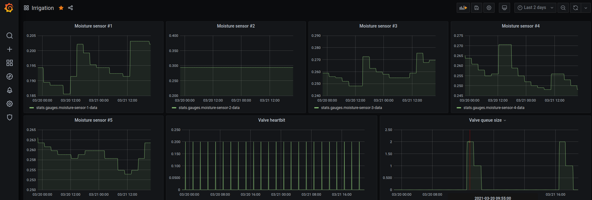

# Irrigation system improvements

## Screenshots



## Moisture sensor

TBD

## Valve V2

Controller based on ESP32 since 

For switching of buttons the nest pins are used
  - GPIO16 - "Manual button"
  - GPIO17 - "Increase button"
  - GPIO21 - "Channel button"

Indicator is using GPIO2

## Uploading firmware

```
esphome valve-v2.yaml run
```

## Testing

For this purpose the tool is required https://hivemq.github.io/mqtt-cli/

### Test switching of valve

When valve awake for sleep mode we got message for the next topic

```
mqtt sub -t valve/1/status -h 192.168.10.105
```

after we have 30 seconds for next command before the device go to the sleep mode again.

Enable channel #1 for one minute

```
mqtt pub -h 192.168.10.105 -t valve/1/channel/1 -m "1"
```

Enable channel #2 for three minutes

```
mqtt pub -h 192.168.10.105 -t valve/1/channel/2 -m "3"
```

### Test moisture sensors

Subscribe to moisture-sensor data by
```
mqtt sub -t moisture-sensor/1/data -h 192.168.10.105
```

## Links and references

  - [ESPHome project](https://esphome.io/index.html)
  - [Mqtt CLI](https://hivemq.github.io/mqtt-cli/)
  - https://esphome.io/api/helpers_8cpp_source.html Useful common functions
  - https://docs.platformio.org/en/latest/platforms/espressif32.html
  
# MQTT exporter

Mqtt exporter copies data from mqtt server to Graphite server by statsd interface.

```bash
npm install
node index.js
```

# Valve controller

Application controls valve based on latest moisture sensor values

```bash
npm install
node index.js
```

### On/Off valve controller

Enable valve controller

```bash
mqtt pub -h 192.168.10.105 -t valve-controller/on -m ""
```

Disable valve controller

```bash
mqtt pub -h 192.168.10.105 -t valve-controller/off -m ""
```

### Debug of valve controller

Testing of valve controller by sending a debug messages

```bash
mqtt pub -h 192.168.10.105 -t valve-controller/add-task -m "{\"topic\": \"valve/1/channel/2\", \"value\": \"1\"}"
```

# K8S configuration

For configuration of k8s there is the file ./irrigation.yml

```bash
# Apply configuration
kubectl apply -f ./irrigation.yml

# Clean all pods
kubectl delete all --all -n irrigation
```
